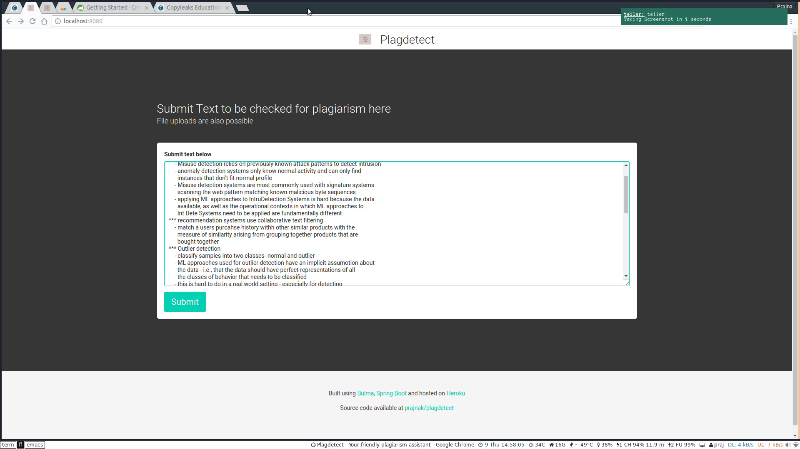
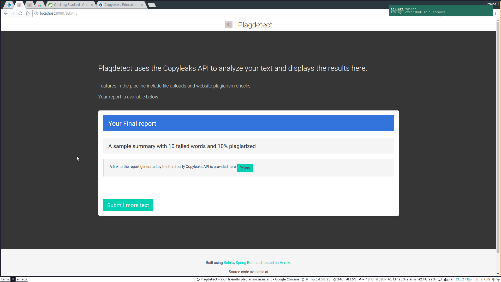

# A sample app to use the copyleaks API to check user submitted text for plagiarism.
### App has been deployed to heroku here:
[https://safe-fjord-76241.herokuapp.com/submit](https://safe-fjord-76241.herokuapp.com/submit)

## Screenshots



## IMPORTANT 

-- copyleaks has become excruciatingly slow, so I'm unable to reliably get
reports back from them for now. Get in touch @ spspkand at uwaterloo dot ca for
help.


[Copyleaks Api](https://api.copyleaks.com/Guides/HowToUse)
- I had to checkin the copyleaks sdk source instead of using the jar as I wasn't
  able to figure out how to add a local jar to a mvn project repo and import it
  from inside the spring boot controller classes

App Framework obtained from [Spring boot starter web](https://mvnrepository.com/artifact/org.springframework.boot/spring-boot-starter-web)


## Build Instructions
Get all the dependencies and build from scratch
```
./mvnw -DskipTests clean dependency:list install
```

## Run locally
```
./mvnw spring-boot:run
```
